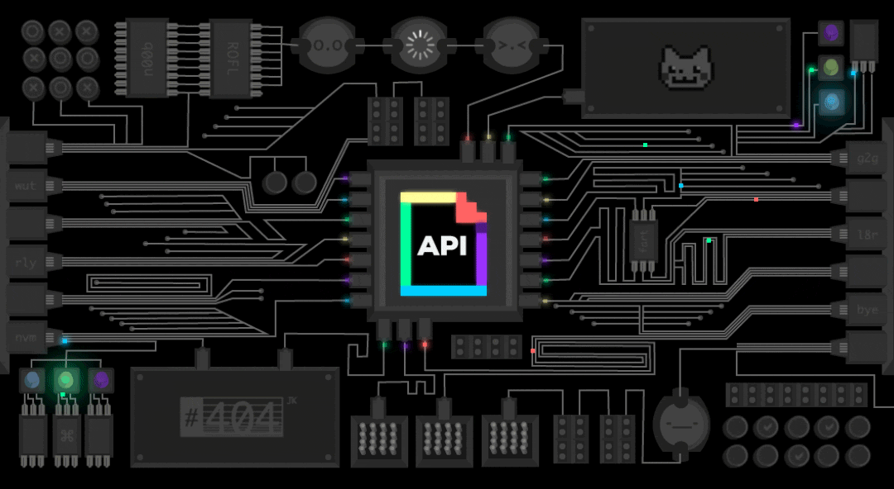

<p align="center">
    
</p>

# Open API

Api ini dibuat untuk kebutuhan pribadi. Karena kebanyak website cv tidak memilik feature contact me. Jadi kalian bisa menggunakan codingan ini. Jika ada pertanyaan bisa contact me.

## Features
* Post message from contact me

## Reporting Issues

To report issues with the API or its documentation, please use the Github Issues tab for this repo. We appreciate your feedback!

## Cara penggunaan
* Clone this repo
* Instal dependenciess 
* Running locally

Pastikan anda membuat env di local mengikuti format env file.

Dan email yang kamu gunakan harus :
* Memberikan acces kepada aplikasi yang kurang dipercaya
* Not enable 2 authentikasi


<br>  

# DOC API

----
**Send Message**
----
  Mengirim pesan balasan dari contact me

* **URL**

  http://localhost:3000/send

* **Method:**
  
  `POST`

* **Request Headers**

   none
  
* **URL Params**

   none

* **Data Params**

  | key | value | required |
  | :---: | :---: | :---: |
  | to | STRING | true |
  | name | STRING | false |
  | subject | STRING | true |
  | text | STRING | true |


* **Success Response:**
  
  
  * **Code:** 200 OK <br />
    **Content:** 
    ```json
    { 
      "message": "Success sending message!", 
      "description": "250 2.0.0 OK  1629632652 x19sm14937905pgk.37 - gsmtp" 
    }
    ```
 
* **Error Response:**

    * **Code:** 500 Wrong Password Email di ENV <br />
        **Content:** 
        ```json
        { 
            "message": "Failed sending message!",
            "description": "535-5.7.8 Username and password not accepted. Learn more at\n535 5.7.8  https://support.google.com/mail/?p=BadCredentials c64sm10936922pfc.8 - gsmtp"
         }
        ```

<br>
<br>


## Technologies


[](#) 
